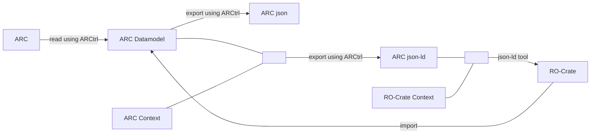

# arc-to-rocrate

Repository for exporting the arc to a RO-Crate.

### General workflow

The `ARC` has to be exported to json together with its [jsonld context](http://niem.github.io/json/reference/json-ld/context/) file. This can then be flattened into a concise and semantically correct `ro-crate`.

The `RO-Crate` (and therefore also the `ARC json-ld`) should be designed in a way to allow complete (without loss) import into the ARC datamodel. So the ARC json-ld should cover all logical connections that are important for the ARC.

This repository contains scripts and/or other functionality for converting the `ARC json-ld` to a proper `RO-Crate`. The F# script `export_and_flatten_arc.fsx` loads an example ARC (from the `ARCCtrl` tests), uses `ARCCtrl` to export the json representation of the ARC, and then converts it into an RO-Crate using the [`flatten`](https://www.w3.org/TR/json-ld11-api/#dfn-flattened) function of the [`json-ld.net`](https://www.nuget.org/packages/json-ld.net) library.

### Profiles

RO-Crate profiles could act as a kind of RO-Crate ARC specification and would give us visibility in the RO-Crate community. They are separated in a human readable and a machine readable component. 

- Investigation
  - [Description](/profiles/investigation.md)
  - [Json Schema](/profiles/investigation.json) (work in progress)
- Study
  - work in progress
- Assay
  - work in progress 

