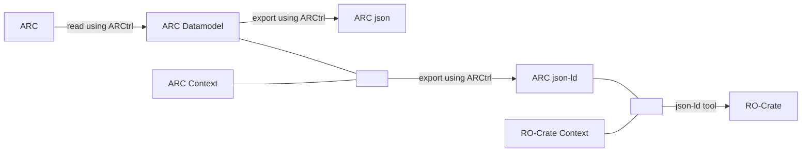

# arc-to-rocrate

Repository for exporting the arc to a RO-Crate.

### General workflow

The `ARC` has to be exported to json together with its [jsonld context](http://niem.github.io/json/reference/json-ld/context/) file. This can then be flattened into a concise and semantically correct `ro-crate`.

This repository contains scripts and/or other functionality for converting the `ARC json-ld` to a proper `RO-Crate`.