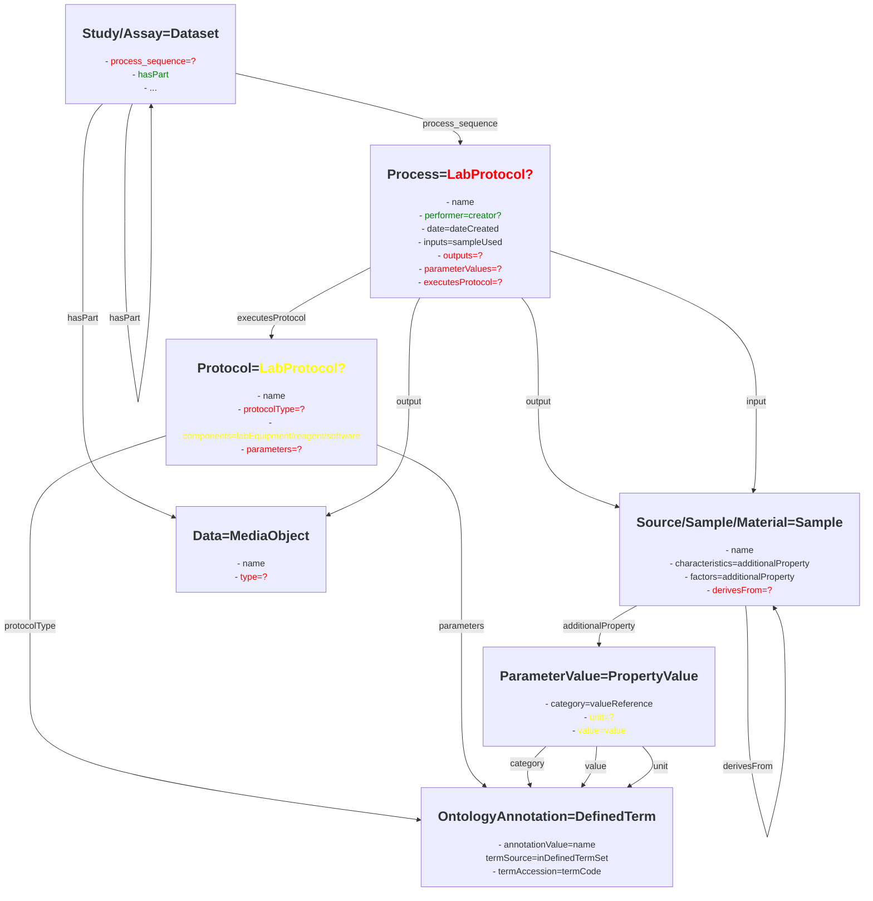

# Mapping the ISA Process Model to RO-Crate/schema.org/bioschemas

Abstract/simplified version of the core ISA Process Model with its mapping to schema.org/bioschemas types:



When only considering the core "functionality" of ISA, seven types need to be mapped: `Study`/`Assay` (merged since they both represent a process sequence with additional metadata), `Process`, `Protocol`, `Source`/`Sample` (merged since a source is a sample without factors), `Data`, `OntologyAnnotation`, and `ParameterValue` (representing all forms of values, e.g. `FactorValue`, `MaterialAttributeValue`, etc.).
`Study`/`Assay` should be a `Dataset`, as required by RO-Crate.
`Data` should be a `MediaObject`/`File`, again as required by RO-Crate.
For `Material`, the type `BioSample` already exists in bioschemas.
An `OntologyAnnotation` can be mapped to `DefinedTerm` and a `ParameterValue` to `PropertyValue`.
Apart from the process sequence, only minor changes are necessary for these types (more details later).
Mapping the process sequence is the core problem, which we explain now.

## Main types missing

In terms of ISA, the LabProtocol type is an incomplete mixture of two things at once:
- `Protocol` (properties `protocolPurpose`, `protocolAdvantage`, `protocolOutcome`, etc.)
- `Process` (`sampleUsed`, `executionTime`).

It can also interpreted as a `ProcessSequence`, considering the `step` property.

For a `Process` the following concepts are missing:
- `output`/"sampleProduced"
- `parameters` and their values
- maybe executed protocol

For a Protocol the following concepts are missing:
- `parameters`

Further minor problems when mapping these ISA types to a LabProtocol:
- `labEquipment`/`reagent`/`software` are `components` in ISA, but components are CV key-value pairs (in particular in the ARC), which would make `PropertyValue` more suitable than `DefinedTerm`
- `protocolType` does not exist in `LabProtocol`
- `nextProcess`/`previousProcess` do not exist in `LabProtocol`

## Parameter Values

`ParameterValues` in ISA are very generic key-value pairs. Thus, the `PropertyValue` type seems to fit well. However, in schema.org, only the key (`valueReference`) can be an ontology annotation (`DefinedTerm`). In ISA, the value and the unit can also be ontology terms (e.g. an organism). In a `PropertyValue`, the value can only be `StructuredValue`, not `DefinedTerm`. The unit only has a code and a text, not an ontology reference.

Our desired schema for `PropertyValue` would look like this:
```JSON
{
    "valueReference" : {
        "anyOf" : [
            {"$ref": "DefinedTerm_schema.json#"},
            ...
        ]
    },
    "value": {
        "anyOf" : [
            { "$ref": "DefinedTerm_schema.json#"},
            { "type": "string"},
            { "type": "number"}
        ]
    },
    "unitReference": {
        "$ref": "DefinedTerm_schema.json#"
    }
}
```

## Type Definitions

According to the problems decribed above, we propose the following new or adapted types:

- [Process](/schemas/process_schema.md)
- [Protocol](/schemas/protocol_schema.md)
- [PropertyValue](/schemas/propertyvalue_schema.md)